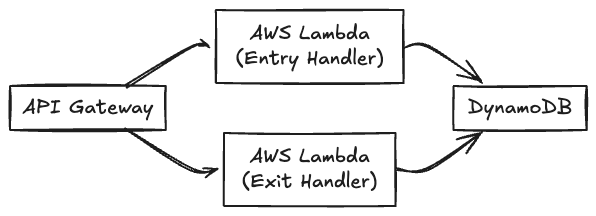

# Parking Lot Management System

This project is a cloud-based parking lot management system built with Go and AWS serverless technologies. It provides REST API endpoints to record vehicle entry and exit, automatically issues parking tickets, and calculates parking fees at $10 per hour with 15-minute increments ($2.50 per 15 minutes).

## Project Structure

```shell
├── .github
│   └── workflows     # GitHub Actions workflows
├── cmd
│   ├── lambda        # Lambda handler entry point
│   └── local         # Local API server entry point
├── deployment        # Terraform deployment code
├── internal
│   ├── handler       # API request handlers
│   ├── logger        # Logging utilities
│   ├── mocks         # Mock implementations for testing
│   ├── model         # Data models
│   └── service       # Business logic services
├── pkg
│   └── lambda        # Lambda adapter
├── scripts           # Utility scripts for testing and automation
├── server
│   └── api           # Generated API code
├── spec              # API specifications
└── test
    └── integration   # Integration tests
```

## Architecture

The system is built with a serverless architecture using:

- **Frontend**: REST API (API Gateway)
- **Backend**: Go with Gin framework running on AWS Lambda
- **Database**: Amazon DynamoDB
- **Infrastructure**: Defined as code using Terraform

### System Components



## Features

- **Vehicle Entry**: Records vehicle entry with license plate and assigns unique ticket ID
- **Vehicle Exit**: Processes vehicle exit with fee calculation
- **Parking Fee Calculation**: $2.50 per 15-minute increment (e.g., $10 per hour)
- **Serverless Operation**: Scales automatically with demand
- **Cloud-Native**: Designed for AWS cloud environment

## Getting Started

### Prerequisites

- Go 1.24+
- AWS CLI configured
- Terraform CLI
- Make

### Setup

1. Clone the repository:

   ```bash
   git clone https://github.com/Avielyo10/parking-lot.git
   cd parking-lot
   ```

2. Install dependencies:

   ```bash
   go mod download
   ```

### Local Development

To build the Lambda functions:

```bash
make build
```

## API Endpoints

### Record Vehicle Entry

```
POST /entry?plate={licensePlate}&parkingLot={lotID}
```

- Records vehicle entry and generates a ticket
- Returns a ticket ID for future reference

### Process Vehicle Exit

```
POST /exit?ticketId={ticketID}
```

- Processes vehicle exit
- Returns details including license plate, parking lot, duration, and charge

## Deployment

Deploy infrastructure with Make:

   ```bash
   make deploy
   ```

## License

This project is licensed under the MIT License - see the [LICENSE](./LICENSE) file for details.
